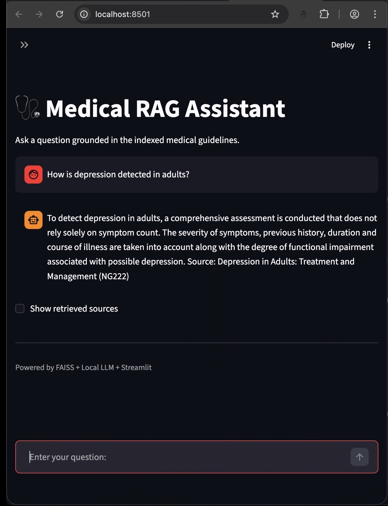
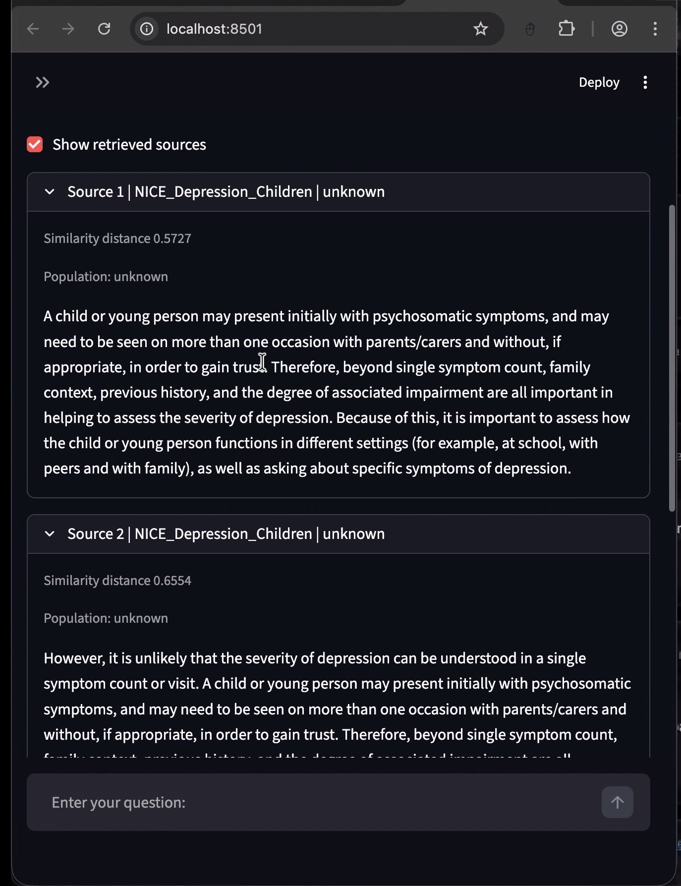

# Capstone 1 - RAG + LLM Medical Assistant

## Overview

This project is a continuation of my learning journey into the realm of DS / DE / DA. It focuses on establishing a practical understanding of Retrieval-Augmented Generation (RAG) systems, LLM's context and prompt engineering by using a hands-on approach.

This project demonstrates the full lifecycle of a RAG system: document ingestion, embedding, vector storage, retrieval, prompt construction and local LLM inference.

---

## Demo Screenshots

<p align = "center">
  
</p>

<p align = "center">
  
</p>

---

## System Architecture

High-level workflow:

1. Download medical guideline PDFs
2. Extract text from PDFs
3. Clean and preprocess text
4. Chunk documents
5. Generate embeddings
6. Store vectors in FAISS
7. Retrieve relevant chunks per query
8. Build RAG prompt
9. Generate answer using local LLM
10. Display results in Streamlit UI

This forms a full RAG lifecycle: **Documents → Vectors → Retrieval → Prompt → LLM → UI**.

---

## Components of System

### System Scripts

- **Chunk Retrieval Script** : `retrieval_faiss.py`
- **RAG Pipeline** : `rag_pipeline.py`
- **UI Interface** : `streamlit_app.py`

### Standalone Scripts

- **LLM Invocation** : `llama-cpp.py`
- **Raw Data Source** : `https://wwww.nice.org.uk/guidance` (Refer to sources.md for breakdown)
- **Text Extraction** : `extract_pdf_text.py`
- **Extracted Text Cleaning** : `clean_text.py` (Manual removal of text involved as well)
- **Clean Text Chunking** : `clean_text_chunking.py`
- **Master Copy Generation** : `combine_chunks_embeddings.py` (`.npy` , `.pkl` and `index` Master files)

### Large Language Model

- **Meta-llama-3.1-8b-instruct-q4_k_m.gguf**

Note: You might need to create account and token in order to download from huggingface

---

## Dependencies Used

### PDF Text Extraction & Cleaning

- **pdfplumber**
- **re** <- RegularExpression

### Chunking \ Embedding \ Retrieval

- **nltk** <-Natural Language Toolkit
- **numpy**
- **pickle**
- **Sentence_Transformer**
- **faiss** <- Facebook AI Similarity Search

### LLm Inference

- **llama.cpp**

Note: The reason llama.cpp was chosen due to the fact that it allows me to go underneath the hood and deepen my understanding the mechanism behind LLM and its corresponding parameters such as temperature, penalties and mirostat. Though this experience brings up more questions than clarity, but it made me appreciate the potential and limitations of LLMs.

### Streamlit UI

- **streamlit**

---

## Environment Setup

1. Clone repo
2. Download **Meta-llama-3.1-8b-instruct-q4_k_m.gguf**
- Source: https://huggingface.co/joshnader/Meta-Llama-3.1-8B-Instruct-Q4_K_M-GGUF
3. Create environment:

- Navigate to project root folder
- run **python3 -m venv <user_defined_env_name>**
- run **source <user_defined_env_name>/bin/activate**	# Mac/Linux
- **user_defined_env_name\Scripts\activate**	# Windows
- run **pip install -r requirements.txt**
- run **streamlit run streamlit_app.py**

---

## Example Queries

- "How is sepsis detected during pregnancy?"
- "What are the symptoms of depression?"

## Project Structure

```
Capstone_1_Healthcare_Rag
|
|--assets/
|   |__query_response.jpeg
|   |__retrieved_chunks.jpeg
|
|--capstone_1			<-- environment (ignored by git)
|
|--data/
|   |__chunks
|   |__cleaned			<-- cleaned text before chunking (ignored by git)
|   |__extracted		<-- extracted text from pdfs (ignored by git)
|   |__raw			<-- downloaded pdfs (ignored by git)
|   |__sources.md		<-- named source for pdfs
|
|--llm				<-- downloaded llm (ignored by git)
|
|--README.md
|
|--requirements_commented.txt	<-- commented copy of dependencies (AI generated)
|
|--requirements.txt		<--for downloading/installing dependencies
|
|--scripts			<-- consolidated scripts (refer to above section for more details)
|   |__clean_text_chunking.py
|   |__clean_text.py
|   |__combine_chunks_embeddings.py
|   |__extract_pdf_text.py
|   |__llama-cpp.py
|   |__rag_pipeline.py
|   |__retrieval_faiss.py
|   |__streamlit_app.py
```
---

## Results

The result is a Healthcare Assistant powered by:
- FAISS vector retrieval 
- Sentence-transformer embeddings
- Local LLM interface
- Streamlit UI

A Healthcare Assistant app that runs on RAG retrieval system + LLM for grounded medical responses without hallucinations. 

Note - Is a one prompt, one answer configuration. This application only takes current query into LLM's context window. Earlier queries will not be fed into the LLM's prompt.

Note - This application is not for actual medical practices but rather a personal learning project.

---

## Contributions

This is an AI-driven learning project. Personal notes / comments are inserted within scripts to assist anyone who trying to understand the script. These notes also serve the purpose of refresher for myself.
Suggestions and feedback are welcome!! Let's all learn together!